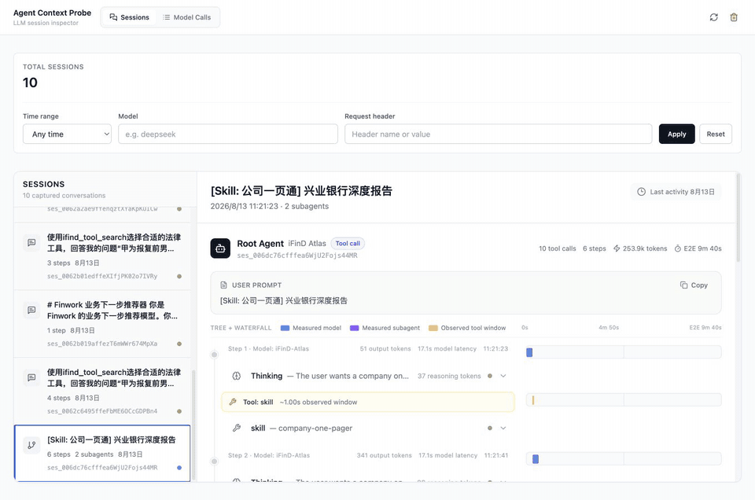

# Claude Code Proxy



A transparent proxy for forwarding, capturing, and visualizing Anthropic Messages,
OpenAI Chat Completions, and OpenAI Responses API requests, with optional Claude
Code subagent routing to different LLM providers.

## What It Does

Claude Code Proxy serves three main purposes:

1. **Multi-protocol API Proxy**: Transparently forwards Anthropic Messages,
   OpenAI Chat Completions, and OpenAI Responses requests.
2. **Request Monitor**: Stores requests and responses in SQLite and displays
   normalized messages, tool calls, tool results, model routing, latency, token
   usage, and raw payloads in the web dashboard.
3. **Agent Routing (Optional)**: Routes specific Claude Code subagents to
   different LLM providers (for example, route `code-reviewer` to GPT-4o).

## Features

- **Transparent Proxy**: Forwards Anthropic and OpenAI-compatible requests without changing the client workflow
- **Agent Routing (Optional)**: Map specific Claude Code agents to different LLM models
- **Request Monitoring**: SQLite-based logging of all API interactions
- **Multi-protocol Endpoints**: Supports `/v1/messages`, `/v1/chat/completions`, and `/v1/responses`
- **Web Dashboard**: Refreshable request history with detailed request and response visualization
- **Request Filtering**: Filter history by time range, model, or request header
- **Tool-call Inspection**: Normalized tool calls and tool results across supported protocols
- **Streaming Inspection**: Stores raw SSE while presenting the completed structured response
- **Easy Setup**: One-command startup for both services

## Quick Start

### Prerequisites
- **Option 1**: Go 1.20+ and Node.js 18+ (for local development)
- **Option 2**: Docker (for containerized deployment)
- Claude Code

### Installation

#### Option 1: Local Development

1. **Clone the repository**
   ```bash
   git clone https://github.com/seifghazi/claude-code-proxy.git
   cd claude-code-proxy
   ```

2. **Configure the proxy**
   ```bash
   cp config.yaml.example config.yaml
   ```

3. **Install and run** (first time)
   ```bash
   make install  # Install all dependencies
   make dev      # Start both services
   ```

4. **Subsequent runs** (after initial setup)
   ```bash
   make dev
   # or
   ./run.sh
   ```

#### Option 2: Docker

1. **Clone the repository**
   ```bash
   git clone https://github.com/seifghazi/claude-code-proxy.git
   cd claude-code-proxy
   ```

2. **Configure the proxy**
   ```bash
   cp config.yaml.example config.yaml
   # Edit config.yaml as needed
   ```

3. **Build and run with Docker**
   ```bash
   # Build the image
   docker build -t claude-code-proxy .
   
   # Run with default settings
   docker run -p 3001:3001 -p 5173:5173 claude-code-proxy
   ```

4. **Run with persistent data and custom configuration**
   ```bash
   # Create a data directory for persistent SQLite database
   mkdir -p ./data
   
   # Option 1: Run with config file (recommended)
   docker run -p 3001:3001 -p 5173:5173 \
     -v ./data:/app/data \
     -v ./config.yaml:/app/config.yaml:ro \
     claude-code-proxy
   
   # Option 2: Run with environment variables
   docker run -p 3001:3001 -p 5173:5173 \
     -v ./data:/app/data \
     -e ANTHROPIC_FORWARD_URL=https://api.anthropic.com \
     -e PORT=3001 \
     -e WEB_PORT=5173 \
     claude-code-proxy
   ```

5. **Docker Compose (alternative)**
   ```yaml
   # docker-compose.yml
   version: '3.8'
   services:
     claude-code-proxy:
       build: .
       ports:
         - "3001:3001"
         - "5173:5173"
       volumes:
         - ./data:/app/data
         - ./config.yaml:/app/config.yaml:ro  # Mount config file
       environment:
         - ANTHROPIC_FORWARD_URL=https://api.anthropic.com
         - PORT=3001
         - WEB_PORT=5173
         - DB_PATH=/app/data/requests.db
   ```
   
   Then run: `docker-compose up`

### Using the Proxy

For Claude Code or another Anthropic-compatible client, set:
```bash
export ANTHROPIC_BASE_URL=http://localhost:3001
```

Then launch Claude Code using the `claude` command.

This will route Claude Code's requests through the proxy for monitoring.

For an OpenAI-compatible client, set the client's base URL to:

```text
http://localhost:3001/v1
```

Configure this in the client itself. In the proxy process,
`OPENAI_BASE_URL` means the upstream provider URL, not the local listening URL.

The proxy accepts:

- `POST /v1/messages` for the Anthropic Messages API
- `POST /v1/chat/completions` for OpenAI Chat Completions
- `POST /v1/responses` for the OpenAI Responses API
- `GET /v1/models` for OpenAI-compatible model discovery

Client authorization headers are forwarded by default. If
`providers.openai.api_key` or `OPENAI_API_KEY` is configured, that key replaces
the incoming authorization header for requests forwarded to the OpenAI
provider.

### Access Points
- **Web Dashboard**: http://localhost:5173
- **API Proxy**: http://localhost:3001
- **Health Check**: http://localhost:3001/health

## Advanced Usage

### Running Services Separately

If you need to run services independently:

```bash
# Run proxy only
make run-proxy

# Run web interface only (in another terminal)
make run-web
```

### Available Make Commands

```bash
make install    # Install all dependencies
make build      # Build both services
make dev        # Run in development mode
make clean      # Clean build artifacts
make db-reset   # Reset database
make help       # Show all commands
```

## Configuration

### Basic Setup

Create a `config.yaml` file (or copy from `config.yaml.example`):
```yaml
server:
  port: 3001

providers:
  anthropic:
    base_url: "https://api.anthropic.com"
    
  openai: # if enabling subagent routing
    api_key: "your-openai-key"  # Or set OPENAI_API_KEY env var
    base_url: "https://api.openai.com/v1"

storage:
  db_path: "requests.db"
  max_capture_bytes: 10485760

web:
  show_raw_stream_events: false
```

`providers.openai.base_url` is an API prefix. The proxy appends
`/chat/completions` or `/responses` while preserving any gateway path prefix.
Streaming events are stored as raw SSE and as a structured result only after a
valid terminal event is received.

`storage.max_capture_bytes` limits only the request and response data retained
in SQLite; it does not truncate the proxied exchange. Set it to `0` for
unlimited capture.

> **Security:** Request and response headers are stored and displayed exactly
> as received, including authorization and cookie headers. Protect access to
> both the dashboard and `requests.db`.

### Subagent Configuration (Optional)

The proxy supports routing specific Claude Code agents to different LLM providers. This is an **optional** feature that's disabled by default.

#### Enabling Subagent Routing

1. **Enable the feature** in `config.yaml`:
```yaml
subagents:
  enable: true  # Set to true to enable subagent routing
  mappings:
    code-reviewer: "gpt-4o"
    data-analyst: "o3"
    doc-writer: "gpt-3.5-turbo"
```

2. **Set up your Claude Code agents** following Anthropic's official documentation:
   - 📖 **[Claude Code Subagents Documentation](https://docs.anthropic.com/en/docs/claude-code/sub-agents)**

3. **How it works**: When Claude Code uses a subagent that matches one of your mappings, the proxy will automatically route the request to the specified model instead of Claude.

### Practical Examples

**Example 1: Code Review Agent → GPT-4o**
```yaml
# config.yaml
subagents:
  enable: true
  mappings:
    code-reviewer: "gpt-4o"
```
Use case: Route code review tasks to GPT-4o for faster responses while keeping complex coding tasks on Claude.

**Example 2: Reasoning Agent → O3**  
```yaml
# config.yaml
subagents:
  enable: true
  mappings:
    deep-reasoning: "o3"
```
Use case: Send complex reasoning tasks to O3 while using Claude for general coding.

**Example 3: Multiple Agents**
```yaml
# config.yaml
subagents:
  enable: true
  mappings:
    streaming-systems-engineer: "o3"
    frontend-developer: "gpt-4o-mini"
    security-auditor: "gpt-4o"
```
Use case: Different specialists for different tasks, optimizing for speed/cost/quality.

### Environment Variables

Override config via environment:

- `PORT` - Proxy server port
- `READ_TIMEOUT`, `WRITE_TIMEOUT`, `IDLE_TIMEOUT` - Go duration strings such as `30s` or `10m`
- `ANTHROPIC_FORWARD_URL` - Anthropic upstream base URL
- `ANTHROPIC_VERSION` - Anthropic API version
- `ANTHROPIC_MAX_RETRIES` - Maximum Anthropic retry count
- `OPENAI_BASE_URL` - OpenAI-compatible upstream API prefix
- `OPENAI_API_KEY` - Optional upstream OpenAI API key
- `DB_PATH` - SQLite database path

Subagent mappings are configured under `subagents.mappings` in `config.yaml`.
When running the web service separately, `BACKEND_URL` selects the proxy backend
and defaults to `http://localhost:3001`.

### Docker Environment Variables

All environment variables can be configured when running the Docker container:

| Variable | Default | Description |
|----------|---------|-------------|
| `PORT` | `3001` | Proxy server port |
| `WEB_PORT` | `5173` | Web dashboard port |
| `READ_TIMEOUT` | `600` | Server read timeout (seconds; Docker entrypoint converts it to a duration) |
| `WRITE_TIMEOUT` | `600` | Server write timeout (seconds; Docker entrypoint converts it to a duration) |
| `IDLE_TIMEOUT` | `600` | Server idle timeout (seconds; Docker entrypoint converts it to a duration) |
| `ANTHROPIC_FORWARD_URL` | `https://api.anthropic.com` | Target Anthropic API URL |
| `ANTHROPIC_VERSION` | `2023-06-01` | Anthropic API version |
| `ANTHROPIC_MAX_RETRIES` | `3` | Maximum retry attempts |
| `OPENAI_BASE_URL` | `https://api.openai.com/v1` | Target OpenAI-compatible API prefix |
| `OPENAI_API_KEY` | empty | Optional upstream OpenAI API key |
| `DB_PATH` | `/app/data/requests.db` | SQLite database path |

Example with custom configuration:
```bash
docker run -p 3001:3001 -p 5173:5173 \
  -v ./data:/app/data \
  -e PORT=8080 \
  -e WEB_PORT=3000 \
  -e ANTHROPIC_FORWARD_URL=https://api.anthropic.com \
  -e DB_PATH=/app/data/custom.db \
  claude-code-proxy
```


## Project Structure

```
claude-code-proxy/
├── proxy/                  # Go proxy server
│   ├── cmd/               # Application entry points
│   ├── internal/          # Internal packages
│   └── go.mod            # Go dependencies
├── web/                   # React Remix frontend
│   ├── app/              # Remix application
│   └── package.json      # Node dependencies
├── run.sh                # Start script
├── .env.example          # Environment template
└── README.md            # This file
```

## Features in Detail

### Request Monitoring
- All API requests logged to SQLite database
- Request history filtering by time range, model, and header
- Request/response body inspection
- Protocol-aware message, tool-call, and tool-result rendering
- Status, timing, token usage, and routing metadata

### Web Dashboard
- Refreshable captured-request history
- Interactive request explorer
- Normalized Anthropic Messages, OpenAI Chat Completions, and OpenAI Responses display
- Raw request and response inspection
- Optional raw SSE event viewer via `web.show_raw_stream_events`

## License

MIT License - see [LICENSE](LICENSE) for details.
